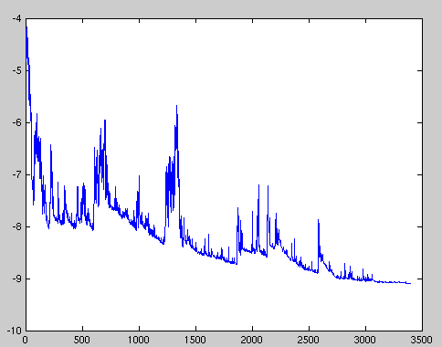

# Optimizing

### 一、Gradient-Descent（梯度下降算法）

梯度下降算法是目前执行机器学习优化任务最好的算法之一，也是在优化神经网络（深度学习）经常会用到的算法。在众多的深度学习框架中都内置了大量的梯度下降算法，例如：TensorFlow、PyTorch、Caffe/Caffe2、Kreas。

通过梯度下降算法是一种最小化目标函数（通常为优化任务中的loss函数）$$J（\theta)$$的一种方法，通过计算目标函数$$J（\theta)$$的梯度$$ \nabla_{\theta}J(\theta)$$反向更新模型的参数$$\theta \in R ^d$$ 。学习率（learning_rate）决定我们到达$$J(\theta)$$函数 （局部）最小值每次更新迭代所用的步长，换句话说，当我们由山上下到山谷的时候，我们从山上的某一点沿着由目标函数下坡所形成的表面的斜度的方向，到达山谷，我们的走一步的步长就理解成我们的学习率。


### 二、梯度下降算法的变体

有三种梯度下降的变体，它们用于计算目标函数梯度的数据量有所不同。根据数据量的不同，我们会在参数更新的准确性和执行更新所需的时间之间进行权衡。


#### 1、批量梯度下降算法

  批量梯度下降算法，又称分批梯度下降，计算对于整个训练数据集损失函数与参数$$\theta$$的梯度 :
$$
\theta = \theta -\mu \cdot\nabla _{\theta}J(\theta)
$$
由于我们需要计算整个数据集的梯度以执行*一次*更新，所以批量梯度下降可能非常缓慢，并且对于不适合内存的数据集而言更是棘手，并且批处理梯度下降也不允许我们*在线*更新我们的模型，即在训练过程中新增示例。

在代码中，批梯度下降看起来像这样：

```python
for i in range(nb_epochs):
  params_grad = evaluate_gradient(loss_function, data, params)
  params = params - learning_rate * params_grad
```

对于预定义的迭代次数，我们首先计算`params_grad`整个数据集与参数向量的损失函数的梯度向量`params`。请注意，最先进的深度学习库提供自动区分功能，可有效计算某些参数的梯度。如果你自己求解梯度，为了防止梯度求解错误，那么梯度检测是一个好主意。（请参阅[这里](http://cs231n.github.io/neural-networks-3/)了解如何正确检查梯度的一些重要提示。）

然后，我们根据梯度的方向更新参数，学习速率决定了我们每次执行更新的步长。批量梯度下降算法保证收敛到凸误差曲面的全局最小值和非凸曲面的局部最小值。

#### 2、随机梯度下降算法

相反，随机梯度下降（SGD）通过分别训练*每个*训练样本$$x^{(i)}  和 y^{(i)} $$执行更新参数：
$$
\theta = \theta - \eta \cdot\nabla_{\theta}J(\theta;x^{(i)};y^{(i)})
$$
批量梯度下降为大数据集执行冗余计算，因为它会在每次更新参数之前为类似示例重新计算梯度。SGD通过一次执行一次更新来消除冗余。因此，它通常要快得多，也可以用于在线学习。但是SGD执行频繁更新，导致目标函数的值波动很大，如图1所示。

> 
>
> ​                                                   图1：SGD fluctuation (Source: [Wikipedia](https://upload.wikimedia.org/wikipedia/commons/f/f3/Stogra.png))

尽管批量梯度下降可以使损失函数收敛到参数所在盆地的最小值, 但是SGD 的波动, 一方面使它能够跳到新的或者潜在更好的局部极小值。另一方面, 这最终将复杂化的收敛过程直到精确的最小值, 因为 SGD 将保持超调状态（SGD will keep overshooting）然而实验已经表明，当我们慢慢地降低学习率时，SGD显示出与批量梯度下降相同的收敛行为，几乎可以肯定地SGD将收敛到非凸和凸优化的局部或全局最小值。

。
它的代码片段简单地在训练示例上添加一个循环，并评估每个示例的梯度。请注意，我们按照[本节](http://ruder.io/optimizing-gradient-descent/index.html#shufflingandcurriculumlearning)所述在每次迭代打乱训练数据。

```python
for i in range(nb_epochs):
  np.random.shuffle(data)
  for example in data:
    params_grad = evaluate_gradient(loss_function, example, params)
    params = params - learning_rate * params_grad
```

#### 3、小批量梯度下降算法

小批量梯度下降最终采用了一个两全其美的方式，结合批量梯度下降和随机梯度下降，为每个最小批量的n执行更新训练：
$$
\theta = \theta - \eta \cdot\nabla_{\theta}J(\theta;x^{(i:i+n)};y^{(i:i+n)})
$$
在代码中, 我们现在遍历的是大小为50的小批处理, 而不是遍历整个样本数据：

```python
for i in range(nb_epochs):
  np.random.shuffle(data)
  for batch in get_batches(data, batch_size=50):
    params_grad = evaluate_gradient(loss_function, batch, params)
    params = params - learning_rate * params_grad
```


#### 4、挑战

然而，小批量梯度下降并不能保证良好的收敛性，但提供了一些需要解决的挑战：

- 选择适当的学习速度可能会很困难。学习率太小导致痛苦缓慢的收敛, 而太大的学习率会阻碍收敛, 导致损失函数在最小值左右波动, 甚至发散。
- 学习速率调度 [11]尝试通过例如退火算法来调整训练期间的学习速率，即根据预定时间表降低学习速率或者当迭代次数之间的目标变化低于阈值时降低学习速率。
- 除此之外, 同样的学习率适用于更新所有参数更新。假设我们的数据是稀疏的, 并且我们的特征具有不同的发生概率，我们可能不希望将它们全部得到相同的程度的更新, 但是它同样执行了为较少出现的特征进行了一个较大的更新。
- 另一个关键挑战在最小化神经网络常见的高非凸误差函数时，是避免陷入其许多进入优局部极小值。而Dauphin等人[19]认为，事实上困难不是来自局部极小值，而是来自鞍点（沿着某一方向是稳定的，另一条方向是不稳定的奇点，叫做鞍点），即目标函数在此点上的梯度（一阶导数）值为 0， 但从该点出发的一个方向是函数的极大值点，而在另一个方向是函数的极小值点。这些鞍点通常由相同误差的平台包围，这使得SGD难以逃逸，因为在所有维度上梯度接近于零。

### 三、梯度下降优化算法

在下文中，我们将概述深度学习社区广泛用于处理上述挑战的一些算法。我们不会讨论在实际中计算高维数据集时不可行的算法，例如[牛顿](https://en.wikipedia.org/wiki/Newton%27s_method_in_optimization)法等二阶[方法](https://en.wikipedia.org/wiki/Newton%27s_method_in_optimization)。

#### 1、Momentum算法

新加坡在导航峡谷方面存在困难，即地表曲线在一个维度上比另一个维度陡得多[ [1](http://ruder.io/optimizing-gradient-descent/index.html#fn:1) ]，这在当地最优方案中很常见。在这些情况下，SGD在整个山谷的斜坡上摇摆，而在底部朝着局部最优方向徘徊着前进，如图2所示。


> 
>
> ​                                                              图2：没有动量的迭代


动量[ [2]]是一种有助于加快SGD在相关方向上速度并抑制其他方向振荡的方法，如图3所示。

> 
>
> ​								图3：有动量的迭代

它通过向当前更新梯度添加历史的更新梯度与分数$$\gamma$$的乘积来平衡和加速当前梯度更新操作:
$$
v_t = \gamma v_{t-1} + \eta\nabla_{\theta}J( \theta)\\
\theta=\theta-v_t
$$
注意：动量项$$\gamma$$通常设置为0.9或类似的值。

基本上，当使用动量时，就像我们把球推下山，球在下山时积聚动量，在途中变得越来越快（直到空气阻力到达其末速度，即：$$\gamma < 1$$）。同样的事情发生在我们的参数更新：动量项增加的维度，其梯度指向相同的方向（加速），并减少其梯度改变方向的维度更新（减少了震荡）。因此，我们在减少振荡的同时，获得了更快的收敛，如图4。

> 
>
> ​                                                                图4：Momentum，来源[ 博客园 ](https://blog.csdn.net/tsyccnh/article/details/76673073)

#### 2、Nesterov 加速梯度算法

Momentum算法每下降一步都是由前面下降方向的一个累积和当前点的梯度方向组合而成，然而，一味盲目地沿着斜坡滑下山坡的球也是非常不令人满意。我们希望有一个更聪明的球，一个有见解的球，它知道要在山坡再次倾斜之前放慢速度。

算法公式：
$$
v_t = \gamma v_{t-1}+ \eta \nabla_{\theta} J(\theta - \gamma v_{t-1})\\
\theta = \theta - v_t
$$


Nesterov 加速梯度算法是在原有Momentum算法中的历史梯度上向前走了一段然后在与当前梯度矢量合成梯度，即在B（当前梯度所在的点）沿着历史梯度的向前走一段，然后与B的所在的梯度进行矢量合成形成实际的下降梯度，如图。

> 
>
> ​                                                        图5：Nesterov 加速梯度算法，来源 [博客园](https://blog.csdn.net/tsyccnh/article/details/76673073)

那么它与SGD、Momentum有什么区别呢？

SGD算法就只是单纯的在当前梯度上进行参数更新，因此会在梯度复杂的区域出来极度动荡和下降速度慢的情况。而Nesterov 加速梯度算法和Momentum算法都合理的利用的历史梯度，去优化和加速下降梯度的路径，那它俩之间又有什么区别呢？

> 
>
> ​                                                    图6：SGD\Nesterov \Momentum 
>
> 注：黑色实线表示A点的梯度、蓝色实线表示B点的梯度，红色虚线表示C点的梯度、橙色实线表示历史加权梯度（A点梯度加权之后的梯度）、绿色实线表示B点实际梯度（除SGD外）、D表示从B的更新后的实际下降点 

从图6我们可以看出Momentum与Nesterov都使用了历史梯度对当前梯度进行修正，而Nesterov不同于Momentum在于利用历史梯度进行一次梯度下降C点，之后，计算C点的梯度与之前的历史梯度加权形成新的梯度更新参数，从而梯度下降到了D点。这样的做法相比Momentum更大程度的利用了历史梯度去修正当前梯度，达到了减少震荡和快速收敛的效果。

关于更新的实际步骤我们从他们的算法公式也可以看出：

$$v_t = \gamma v_{t-1}+ \eta \nabla_{\theta} J(\theta - \gamma v_{t-1})$$ 与 $$v_t = \gamma v_{t-1}+ \eta \nabla_{\theta} J(\theta)$$ 


#### 3、Adagrad

Adagrad [ [3](http://ruder.io/optimizing-gradient-descent/index.html#fn:3) ]是一种基于梯度的优化算法，它可以做到的一点是：将学习速率与参数相适应，对频繁参数的频繁更新和更小的更新执行更大的更新。