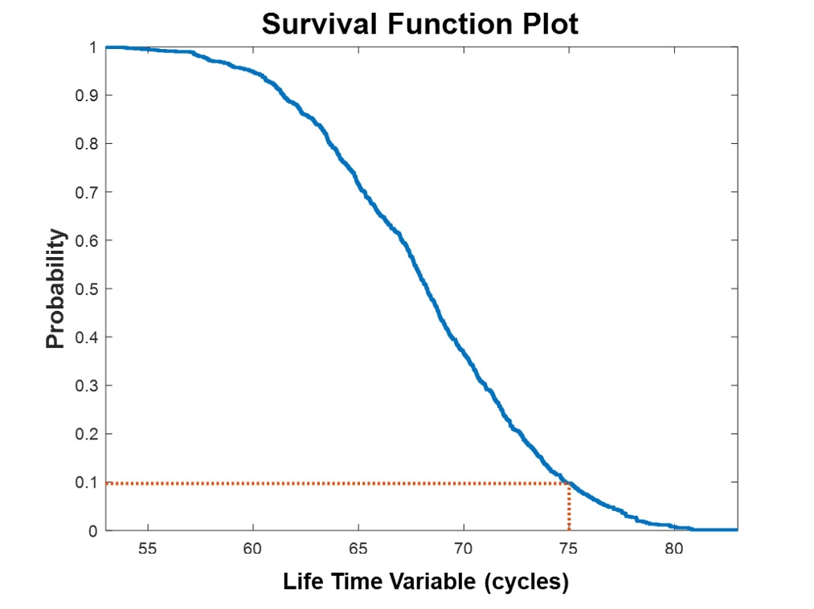
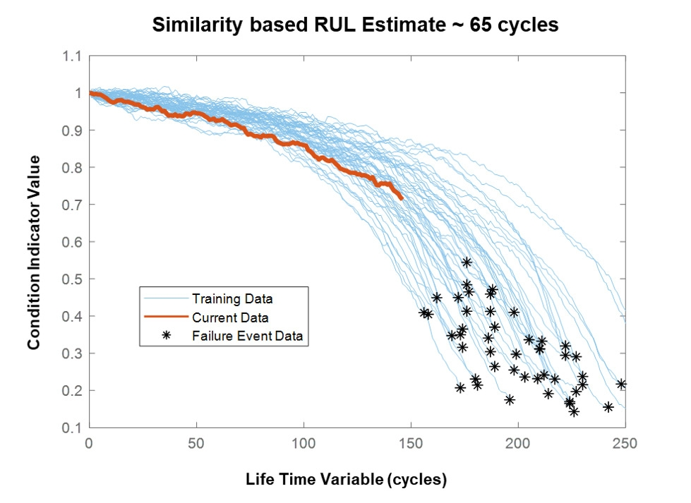
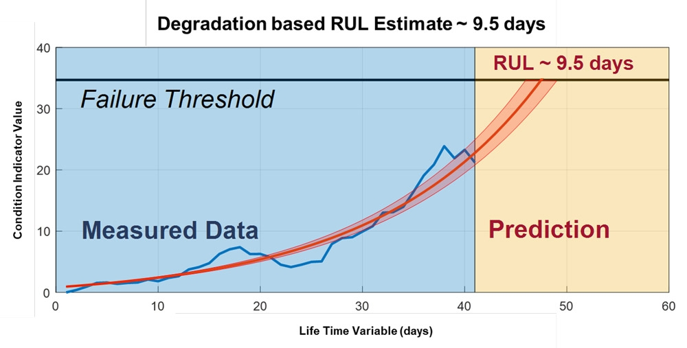

剩余使用寿命（RUL）指在机器维修或更换前的运行时长。借助RUL，工程师可以安排维护时间、优化运行效率并避免计划外停机。因此，预测RUL是预测性维护计划中的首要任务。

RUL预测模型不仅可预测RUL，还可提供预测的置信界限。该模型的输入项是状态指标，即从传感器数据或日志数据提取的特征，其行为随着系统退化或运行模式变化而改变，这种改变是可预测的。

RUL的计算方法取决于可用数据的类型：

- 寿命数据 用于指示相似机器运行至发生故障所用的时长
- 相似机器的运行至故障的历史数据
- 检测故障所用状态指标的已知阈值

## 一、使用寿命数据

### 基于概率

> 预测在特定时间内（如30天内）故障发生的概率

比例风险模型和组件故障时间的概率分布用于根据寿命数据评估RUL。举一个简单的例子，我们可以根据过往充电次数及*协变量*评估电池的放电时间，其中协变量指电池运行环境（如温度）和电池负载等变量。

生存函数图（图1）显示了电池在不同运行时长出现故障的概率。如图所示，如果电池运行了75个周期，则其达到使用寿命的概率为90%。

图1. 生存函数图。在运行75个周期后，电池能够继续运行的概率为0.1或10%。

## 基于回归

> 直接使用历史的RUL数据进行回归

## 二、运行至故障的数据

如果您有一个包含设备运行至故障的数据的数据库，并且该数据来自相似组件或行为方式相似的不同组件，则您可以使用相似方法评估RUL。这些方法会获取退化曲线并将其与来自机器的新数据进行对比，以确定新数据最接近哪种曲线。

在图2中，蓝色表示发动机运行至故障的历史数据集的退化曲线，黄色表示发动机的当前数据。根据发动机最匹配的曲线，预计RUL约为65个周期。

图2. 基于运行至故障的数据的退化曲线（蓝色）。最接近的蓝色曲线的星标（或端点）分布指出RUL为65个周期。

## 三、阈值数据

通常，运行至故障数据或寿命数据没有被记录，但具有关于阈值参考信息。例如，水泵中液体的温度不能超过160oF (71oC)，压力必须低于2200 psi (155 bar)。通过这些信息，您可以将时序模型与提取自传感器数据（如随时间上下波动的温度和压力等）的状态指标进行拟合。

这些*退化模型*通过预测状态指标超出阈值的时间评估RUL。它们还可以与*融合指标*结合使用，后者使用主成分分析等技术融入来自多个状态指标的信息。

图3. 显示跟踪风力涡轮机中所用高速轴承故障的指数退化模型。蓝色显示状态指标。该退化模型预测轴承将在约9.5天后超出阈值。红色阴影部分代表此预测的置信界限。

图3. 高速轴承的退化模型。基于轴承的当前状态数据（蓝色）和与此数据拟合的指数退化模型（红色），该轴承预计的RUL为9.5天。

对RUL进行可靠评估后，您可以将这些评估值集成到仪表盘中，或整合到维护团队监控的警报系统中。随后，各团队可以快速响应设备运行状况的改变，避免影响设备的正常运转。